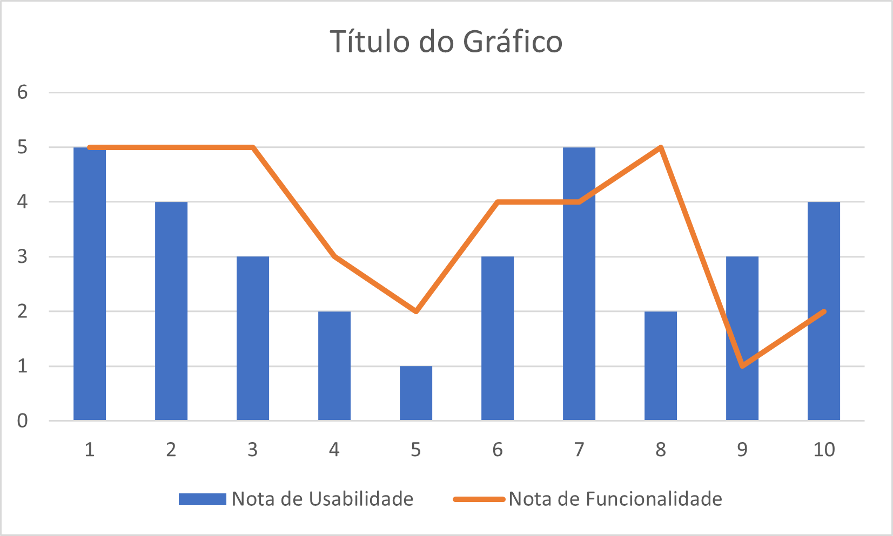

# WAD

[//]: # (include ../README.md)
    
# WEB APPLICATION DOCUMENT
    

# \<NOME DO SISTEMA\>

    

Autores: \< Nome em ordem alfabética (um por linha)\>

Data de criação:\<dia, mês e ano em que o documento foi criado\>

 

## Controle do Documento

 

&emsp;&emsp;**Histórico de revisões**

| **Data** | **Autor** | **Versão** | **Resumo da atividade** |
| --- | --- | --- | --- |
| \<xx/xx/xxxx\>Exemplo: 27/04/2022 | \<Nome do responsável pela versão\>Exemplo: José da Silva | \<número da Sprint.sequencial\>Exemplo: 1.1 | \<descrever o que foi atualizado nesta versão\>Exemplo: Criação do documento |
|

### **Sumário**

1. [Visão Geral do Projeto](#visão-geral-do-projeto)

    1. [Parceiro de Negócios](#parceiro-de-negócios)

    1. [O Problema](#o-problema)

    1. [Objetivos](#objetivos)

        1. [Objetivos gerais](#objetivos-gerais)

        1. [Objetivos específicos](#objetivos-específicos)

    1. [Descritivo da Solução](#descritivo-da-solução)

    1. [Partes Interessadas](#partes-interessadas)

1. [Análise do Problema](#análise-do-problema)

    1. [Análise da Indústria](#análise-da-indústria)

    1. [Análise do cenário: Matriz SWOT](#análise-do-cenário-matriz-swot)

    1. [Proposta de Valor: Value Proposition Canvas](#proposta-de-valor-value-proposition-canvas)

    1. [Matriz de Risco](#matriz-de-risco)

1. [Requisitos do Sistema](#requisitos-do-sistema)

    1. [Persona](#persona)

    1. [Histórias dos usuários (user stories)](#histórias-dos-usuários-user-stories)

1. [Arquitetura do Sistema](#arquitetura-do-sistema)

    1. [Módulos do Sistema e Visão Geral (Big Picture)](#módulos-do-sistema-e-visão-geral-big-picture)

    1. [Tecnologias Utilizadas](#tecnologias-utilizadas)

1. [UX e UI Design](#ux-e-ui-design)

    1. [Wireframe](#wireframe)

    1. [Design de Interface - Guia de Estilos](#design-de-interface---guia-de-estilos)

1. [Projeto de Banco de Dados](#projeto-de-banco-de-dados)

    1. [Modelo Conceitual](#modelo-conceitual)

    1. [Modelo Lógico](#modelo-lógico)

1. [Testes de Software](#testes-de-software)

    1. [Teste de Usabilidade](#teste-de-usabilidade)

[Referências](#referências)

[Apêndice](#apêndice)

#

1. # [**Visão Geral do Projeto**](#sumário)

    1. ## [Parceiro de Negócios](#sumário)
        Breve descrição da instituição representada pelo parceiro de negócios, porte, onde atua, área de mercado que atua e posicionamento no mercado.

    1. ## [O Problema](#sumário)
        Descrever o problema ou a oportunidade de negócio.

    1. ## [Objetivos](#sumário)
        Descrever os objetivos do projeto, objetivos gerais e objetivos específicos.

        1. ### [Objetivos gerais](#sumário)

        1. ### [Objetivos específicos](#sumário)

    1. ## [Descritivo da Solução](#sumário)
        Descrição da solução a ser desenvolvida (o que é, quais principais funcionalidades, como usar) . Caso ainda não esteja definida a solução na Sprint 1, o faça assim que possível.
    1. ## [Partes Interessadas](#sumário)
        Descrever os principais stakeholders envolvidos no projeto e seus papéis.

1. # [Análise do Problema](#sumário)

    1. ## [Análise da Indústria](#sumário)
        Análise da indústria (Modelo de 5 Forças de Porter) em relação ao cenário da empresa parceira.

    1. ## [Análise do cenário: Matriz SWOT](#sumário)
        Apresenta a Matriz SWOT com análise da empresa parceira.

    1. ## [Proposta de Valor: Value Proposition Canvas](#sumário)
        Apresenta o Canvas de Proposta de Valor com relação à solução.

    1. ## [Matriz de Risco](#sumário)
        Apresenta a matriz de risco com relação ao projeto.

1. # [Requisitos do Sistema](#sumário)
    1. ## [Persona](#sumário)
        Apresentar para cada persona o nome, idade, ocupação, interesses, localização, etc. (relacionar com o que foi visto nos encontros e conteúdos de autoestudo sobre definição de personas)

    1. ## [Histórias dos usuários (user stories)](#sumário)
        Descrever em uma tabela todas histórias de usuários de acordo com o template utilizado com priorização, esforço e risco.

1. # [Arquitetura do Sistema](#sumário)

    1. ## [Módulos do Sistema e Visão Geral (Big Picture)](#sumário)

        Diagrama representando hardware e software.

        Mapa ou organograma com os módulos que existem no sistema.

        Por exemplo, um portal principal, em seguida as áreas de acordo com perfil de acesso. Um painel administrativo para controle e gestão, por exemplo.

        E tudo no servidor em nuvem, no nosso caso, Heroku.

        Pode usar uma ferramenta do tipo x-mind, draw.io, etc.

    1. ## [Tecnologias Utilizadas](#sumário)
        Colocar em uma tabela as tecnologias utilizadas na aplicação especificando o que é, em que é utilizada no projeto e qual a versão.

1. # [UX e UI Design](#sumário)
    Projeto das telas do sistema.

    1. ## [Wireframe](#sumário)
        Telas de baixa fidelidade das áreas do usuário, conectados, demonstrando a diagramação e o fluxo de navegação

        Exemplos: tela da home, tela de login, etccc

        Em cada tela colocar: cabeçalho, rodapé, barra lateral, área de conteúdo

        Aqui você deve colocar o link para o wireframe ou colocar as imagens geradas na sequência correta do fluxo de navegação

    1. ## [Design de Interface - Guia de Estilos](#sumário)
        Refere-se ao design visual, cores, tipografia, imagens, logotipos, ou seja, os elementos visuais que compõem o produto.

        Aqui você deve colocar o link para seu documento de guia de estilos

1. # [Projeto de Banco de Dados](#sumário)
      Documento contendo diagrama de entidades e relacionamentos do banco de dados

    1. ## [Modelo Conceitual](#sumário)
        O modelo conceitual deve garantir uma conexão com a realidade. Os 4 tipos de conexões com a realidade são:

        - conceitos
        - atributos
        - identificações
        - associações

        O Modelo Entidade-Relacionamento - MER

        - entidades e tipos de entidades
        - atributos e tipos de atributos
        - relacionamentos e tipos de relacionamentos

    1. ## [Modelo Lógico](#sumário)

1. # [Testes de Software](#sumário)

    1. ## [Teste de Usabilidade](#sumário)
        Link ou imagem da tabela com dados organizados dos testes realizados

#

# [**Referências**](#sumário)

Toda referência citada no texto deverá constar nessa seção, utilizando o padrão de normalização da ABNT). As citações devem ser confiáveis e relevantes para o trabalho. São imprescindíveis as citações dos sites de download das ferramentas utilizadas, bem como a citação de algum objeto, música, textura ou outros que não tenham sido produzidos pelo grupo, mas utilizados (mesmo no caso de licenças gratuitas, royalty free ou similares)
    
| Usuário | Nota de Usabilidade | Nota de Funcionalidade |
|---------|---------------------|------------------------|
| 1       | 5                   | 5                      |
| 2       | 4                   | 5                      |
| 3       | 3                   | 5                      |
| 4       | 2                   | 3                      |
| 5       | 1                   | 2                      |
| 6       | 3                   | 4                      |
| 7       | 5                   | 4                      |
| 8       | 2                   | 5                      |
| 9       | 3                   | 1                      |
| 10      | 4                   | 2                      |

[Gerador de Tabelas em MarkDown - Basta copiar a tabela e colar no site](https://www.tablesgenerator.com/markdown_tables)

    
#

# [**Apêndice**](#sumário)

Os apêndices representam informações adicionais que não caberiam no documento exposto acima, mas que são importantes por alguma razão específica do projeto.
